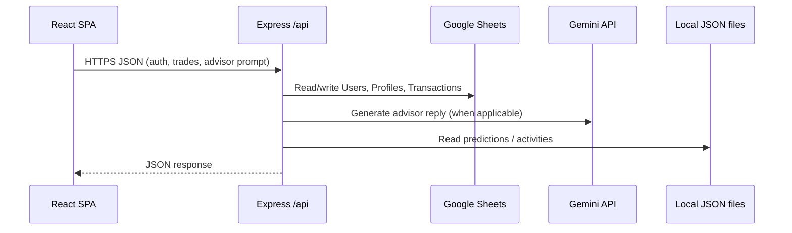

# Chapter 4: Implementation

## 4.1 Development Environment (Tools & Technologies)

Walle-T is implemented as a **full-stack JavaScript** application with optional **Python** tooling for offline model training.

| Layer | Technology | Role |
|-------|------------|------|
| Frontend runtime | [React 19](https://react.dev/) | UI components, routing, client-side state |
| Build tool | [Vite 8](https://vitejs.dev/) | Dev server, bundling, optimized production builds |
| Frontend routing | [react-router-dom 7](https://reactrouter.com/) | SPA routes, protected routes, lazy-loaded pages |
| Styling | Vanilla CSS (glass / premium layout) | Theme variables, responsive layouts |
| Icons | [Lucide React](https://lucide.dev/) | Consistent iconography |
| 3D / motion | [Three.js](https://threejs.org/), [@react-three/fiber](https://github.com/pmndrs/react-three-fiber), [@react-three/drei](https://github.com/pmndrs/drei) | Loading screen and decorative 3D UI elements |
| Markdown in UI | [react-markdown](https://github.com/remarkjs/react-markdown), [remark-gfm](https://github.com/remarkjs/remark-gfm) | Render formatted assistant or content text where used |
| Backend runtime | [Node.js](https://nodejs.org/) | HTTP API process |
| HTTP framework | [Express 5](https://expressjs.com/) | REST-style `/api` handlers |
| Configuration | [dotenv](https://github.com/motdotla/dotenv) | Load `.env` from project root (`backend` resolves parent `.env`) |
| Auth / crypto | [bcryptjs](https://github.com/dcodeIO/bcrypt.js), Node `crypto` | Password hashing; reset-token hashing |
| Persistence API | [googleapis](https://github.com/googleapis/google-api-nodejs-client) (Sheets v4) | Read/write spreadsheet tabs |
| AI | [@google/genai](https://www.npmjs.com/package/@google/genai) (Gemini) | Advisor and related generation |
| Email | [Nodemailer](https://nodemailer.com/) | Password reset / transactional mail when SMTP is configured |
| ML artifact | Python scripts + JSON | e.g. `train_psx_model.py`, output consumed as `psx_model_symbol_predictions.json` (path configurable via `MODEL_PREDICTIONS_PATH`) |

The backend `package.json` may list an **`openai`** package for optional experiments; the implemented advisor integration in this codebase uses **Gemini** (`@google/genai`).

**Repository layout (high level)**:

- `frontend/` — Vite React app (`npm run dev` / `npm run build`).
- `backend/` — Express server (`node server.js`), route modules under `backend/routes/`, static data under `backend/data/`.

## 4.2 System Modules Description

Implementation maps to **route modules** under `backend/routes/` plus shared services and sheet helpers in `backend/server.js`:

| Module (routes file) | Responsibility |
|---------------------|----------------|
| **authRoutes** | Signup, login, session validation, password reset flow against Users sheet + email tokens |
| **healthRoutes** | Operational checks (e.g., presence of sheet IDs / connectivity-oriented summaries) |
| **profileRoutes** | Profile read/update aligned with Sheets-backed profile rows |
| **onboardingRoutes** | Onboarding payload persistence into profile storage |
| **portfolioRoutes** | Aggregated portfolio/ledger views using transactions + profile |
| **tradeRoutes** | Simulated order execution, quote validation for forex where applicable, append transactions |
| **marketRoutes** | Market data orchestration for UI market pages |
| **forecastRoutes** | Forecast endpoints consumed by forecasting UI |
| **modelPredictionRoutes** | Serve ML JSON predictions (PSX symbols) to the client |
| **activitiesRoutes** | Cached/local activity feed (`activities.json`) where implemented |
| **advisorRoutes** | Gemini-backed advisor prompts with server-side rate limiting |
| **riskRoutes** | Risk-related API backing the Risk page |
| **settingsRoutes** | User settings persistence via profile upserts |

**Frontend modules** (pages under `frontend/src/pages/`, shell under `frontend/src/components/`):

- **Login** (`/`): Authentication entry.
- **Onboarding** (`/onboarding`): Guided profile capture (protected).
- **Dashboard home** (`/dashboard`): Main hub after onboarding (protected).
- **Markets**: Stocks (`/market/stocks`), Forex (`/market/forex`); options route may redirect per current `App.jsx`.
- **Portfolio** (`/portfolio`), **Risk** (`/risk`), **Profile** (`/profile`), **Settings** (`/settings`), **Advisor** (`/advisor`), **Company prediction** (`/company/:symbol`).
- **AppShell**, **ProtectedRoute**, **LoadingScreen**, **SimpleLineChart**: Shared layout, auth gating, initial loading UX, and lightweight SVG line charts.

## 4.3 Frontend Implementation

- **SPA structure**: `frontend/src/main.jsx` mounts the app; `frontend/src/App.jsx` defines `BrowserRouter`, **lazy** `React.lazy` imports for route components, and a short initial **LoadingScreen** transition before revealing routes.
- **Protected routes**: `ProtectedRoute` wraps authenticated sections and redirects unauthenticated users as implemented in `frontend/src/auth/AuthContext.jsx` and the guard component.
- **API usage**: Pages call the backend with `fetch` (JSON) against the configured API base; errors surface in UI state where handled per page.
- **Charts**: Portfolio/dashboard visuals use the custom **`SimpleLineChart`** component (SVG path-based), not a third-party charting library.
- **Responsive behavior**: CSS media queries and flexible layouts adapt widths for smaller screens consistent with the global stylesheet strategy.

Key route-to-page mapping is centralized in `frontend/src/App.jsx` for traceability during maintenance.

## 4.4 Backend Implementation

- **Entrypoint**: `backend/server.js` constructs the Express app, applies **CORS**, JSON body parsing, and **`/api`-scoped middleware**: IP+path rate limiting (env-tunable window/max) and slow-request logging on response finish.
- **Advisor fairness**: Additional in-memory buckets enforce minimum spacing and maximum prompts per rolling window for advisor usage (protect quotas and cost).
- **Registration pattern**: Each file under `backend/routes/` exports a `registerXRoutes(app, deps)` style function; `server.js` wires dependencies (sheet readers, Gemini client, helpers).
- **REST surface**: All JSON endpoints are mounted under `/api/...` (exact paths defined per route module).

Representative dependency injections include: `readUsersFromSheet`, `readProfileFromSheet`, `upsertProfileToSheet`, `readTransactionsForUser`, `appendTransactionRow`, Gemini client factories, and ledger computation helpers.

## 4.5 Database Implementation

Persistence uses **Google Sheets** rather than a traditional RDBMS in this implementation.

**Spreadsheet configuration**

- **Users** typically live in the spreadsheet referenced by `GOOGLE_SPREADSHEET_ID` / `Google_Sheet_Id`–style env vars, with optional tab name from `GOOGLE_SHEET_NAME` / `Google_Sheet_Name` / `GOOGLE_SHEET_TAB`. Fallback range names include `Users!A:F`.
- **Transactions and profiles** use the spreadsheet resolved by `Transactional_History` / `TRANSACTION_SHEET_ID`–style vars (`parseSpreadsheetId` supports raw IDs or full Sheets URLs). Default transactional tab name: **`Transactions`** (`TRANSACTION_SHEET_NAME` overrides). Profiles default to tab **`Profiles`** (`PROFILES_SHEET_NAME` overrides).

**Logical schemas (header rows ensured by the server when appending)**

1. **Users** (6 columns, append order): `createdAt`, `username`, `email`, `passwordHash`, `id`, status/tag field (e.g., signup marker).
2. **Transactions** (10 columns): `createdAt`, `userId`, `type`, `symbol`, `qty`, `price`, `amount`, `cashAfter`, `note`, `metaJson`.
3. **Profiles** (11 columns): `userId`, `createdAt`, `updatedAt`, `age`, `country`, `monthlyIncome`, `monthlyExpenses`, `currentCash`, `assetsJson`, `liabilitiesJson`, `extrasJson`.

**Local JSON files**

- **`backend/data/activities.json`** — cached or generated activity listings where used by `activitiesRoutes`.
- **`backend/data/psx_model_symbol_predictions.json`** (or path from `MODEL_PREDICTIONS_PATH`) — ML inference outputs consumed by prediction endpoints and UI.

## 4.6 Integration of System Components

End-to-end flow:

1. **Browser** loads the Vite-built SPA; user obtains a session token or cookie semantics as implemented in auth routes and `AuthContext`.
2. **Authenticated requests** send credentials (e.g., header or body fields per frontend implementation) to **`/api/*`** Express handlers.
3. **Handlers** validate input and identity, then:
   - read/write **Google Sheets** for users, profiles, and ledger rows;
   - optionally call **Gemini** for advisor responses;
   - read **local JSON** for activities or ML predictions.
4. **Responses** return JSON consumed by React pages to update charts, tables, chat transcripts, and forms.

This yields a **three-tier logical architecture**: presentation (React), application (Express), and persistence/external services (Sheets, Gemini, filesystem JSON).

## 4.7 Key Functionalities (with Screenshots)

Screenshots are stored under **`screenshots/`** at the repository root. Add PNG captures after running `frontend` and `backend` locally so the links below resolve in Markdown previews and exported reports.

**How to capture**

1. Start backend (`backend`: `npm run dev` or `node server.js`) and frontend (`frontend`: `npm run dev`).
2. Log in with a test account, complete onboarding if required, and navigate through each area below.
3. Save PNG files using the exact filenames in the table.

| ID | Functionality | Suggested capture | Image path |
|----|----------------|-------------------|------------|
| S1 | Login / registration entry | Login form and branding | `./screenshots/login.png` |
| S2 | Onboarding wizard | Mid-flow financial profile step | `./screenshots/onboarding.png` |
| S3 | Dashboard hub | Main dashboard after login | `./screenshots/dashboard.png` |
| S4 | Stocks market | PSX/stocks market view with quotes or table | `./screenshots/market-stocks.png` |
| S5 | Forex market | Forex pairs view | `./screenshots/market-forex.png` |
| S6 | Simulated trading UI | Order panel with confirmation or positions | `./screenshots/trading.png` |
| S7 | Portfolio | Holdings / performance chart region | `./screenshots/portfolio.png` |
| S8 | AI advisor | Conversation with advisor reply visible | `./screenshots/advisor.png` |
| S9 | Risk assessment | Risk page with score or visualization | `./screenshots/risk.png` |
| S10 | Symbol / company prediction | `/company/:symbol` prediction view | `./screenshots/company-prediction.png` |
| S11 | Settings | Settings form saved state | `./screenshots/settings.png` |

### 4.7.1 Dashboard (hub)

Central navigation and portfolio summary after authentication.

### 4.7.2 Markets and simulated trading

Market browsing (stocks / forex) and execution UI for virtual trades.

### 4.7.3 AI-powered financial advisor

Conversational guidance grounded in server-side context and Gemini.

### 4.7.4 Portfolio, risk, and predictions

Portfolio analytics, risk tooling, and per-symbol prediction pages.

### 4.7.5 Onboarding, login, and settings

Account lifecycle and configuration.

